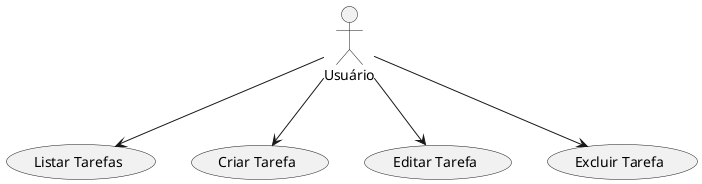
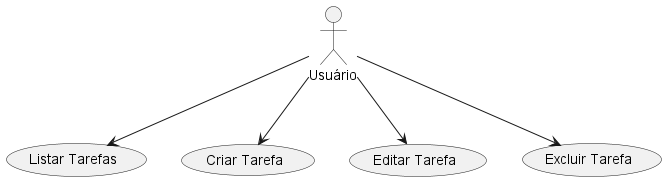
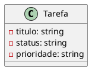
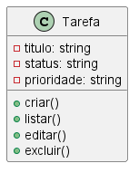

# 📌 TaskFlow Portfolio

> Sistema de gerenciamento ágil de tarefas — projeto de portfólio para a disciplina de Software Engineering.

---


## 🎯 Objetivo

Desenvolver um CRUD de tarefas com Flask, integrando testes automatizados, CI/CD e modelagem UML, organizado via Kanban.

---

## 📑 Requisitos do Projeto

### Requisitos Funcionais

- O sistema deve permitir criar, listar, editar e excluir tarefas.
- Cada tarefa deve conter título, status e prioridade.
- O sistema deve apresentar a lista de tarefas com filtros por status e prioridade.
- A aplicação deve fornecer respostas HTTP adequadas para cada operação CRUD.
- Os testes automatizados devem validar as funcionalidades principais.

### Requisitos Não Funcionais

- O sistema deve ser desenvolvido em Python usando Flask.
- A aplicação deve ter testes unitários integrados, com execução automática via CI.
- O código deve ser organizado modularmente, seguindo boas práticas de engenharia de software.
- O projeto deve integrar GitHub Actions para CI/CD.
- A documentação deve incluir diagramas UML e organização ágil via Kanban.

## 🚀 Como executar localmente

```bash
git clone https://github.com/vrabelobarbosa/taskflow-portfolio.git
cd taskflow-portfolio
python -m venv venv
source venv/Scripts/activate   # no Git Bash
pip install -r requirements.txt
python src/app.py
```

Abra no navegador: `http://127.0.0.1:5000/tarefas`

---

## 📋 Funcionalidades

- Criar, listar, editar e excluir tarefas  
- Cada tarefa tem `título`, `status` e `prioridade`

---

## 🧪 Testes

```bash
pytest -v
```

Testes unitários em `/tests` e CI via GitHub Actions.

---

## 🔧 Integração Contínua (CI)

Este projeto utiliza o GitHub Actions para integração contínua, que automatiza a execução dos testes unitários a cada alteração no código (push ou pull request para a branch `main`). 

Isso garante que possíveis erros sejam detectados rapidamente, evitando regressões e mantendo a qualidade do software durante o desenvolvimento. O workflow está configurado no arquivo `.github/workflows/ci.yml`.

Você pode acompanhar o status das execuções pelo badge no topo deste README.


## 🔄 Kanban

Organização via GitHub Projects em três colunas:

- **A Fazer**  
- **Em Progresso**  
- **Concluído**  

Acesse o board: [Kanban do projeto](https://github.com/users/vrabelobarbosa/projects/2/views/1)


---

## 📎 Diagramas UML

### Casos de Uso




### Diagrama de Classes




---

## ❓ Perguntas Obrigatórias

**1. Quais as causas de falhas em projetos ágeis e como o GitHub ajuda?**  
Falta de comunicação, escopo mal definido e ausência de testes. GitHub mitiga com Issues, Kanban, Pull Requests e CI.

**2. Quem se beneficia?**  
Desenvolvedores, gestores e stakeholders, que ganham visibilidade e qualidade nas entregas.

**3. Como o GitHub Actions garante confiabilidade?**  
Automatiza testes a cada push/PR, impedindo regressões e fornecendo feedback rápido.

**4. Desafios de mudanças em projetos ágeis?**  
Replanejamento, retrabalho e necessidade de atualização de testes e documentação.

**5. Aplicação prática de conceitos de Engenharia de Software?**  
Modelagem UML, modularização, testes, CI/CD e gestão ágil (Kanban).

---

## 👤 Autor

Vinicius Rabelo Barbosa  
[GitHub](https://github.com/vrabelobarbosa)